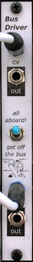
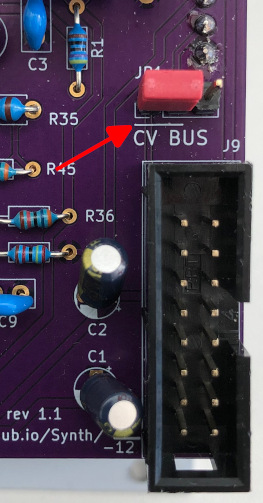
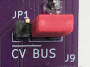

# Eurorack Bus CV and Gate

Some of [my modules](index.html#modules) take advantage of the CV and gate lines that are available in the [16-pin Eurorack power cable](https://doepfer.de/a100_man/a100t_e.htm), to eliminate some of the patching spaghetti that I don’t usually change. Basically, modules that have either a [gate input](https://github.com/Len42/Synth/tree/main/modules/Envelope2) or a volt-per-octave [pitch input](https://github.com/Len42/Synth/tree/main/modules/VCO-2131) will take that signal from the Eurorack bus when the input is unpatched. Patching a signal into the input jack overrides the signal from the bus.

If this feature is not wanted, it can be disabled by a jumper on the back of the module. The jumper’s “enabled” position is marked by an underline, as shown in the photo below.

To put gate and pitch CV signals _onto_ the Eurorack bus, I use my [Bus-Driver module](../modules/Bus-Driver). The CV and gate signals come from either a keyboard or an [interface module](https://www.expert-sleepers.co.uk/es8.html).

 
<i>Jumper to take pitch CV from the bus by default - 
Note the underline indicating the enabled position</i>

 
<i>Default-from-bus jumper, 
disabled position</i>

© 2022 Len Popp This work is licensed under a <a rel="license" href="http://creativecommons.org/licenses/by/4.0/">Creative Commons Attribution 4.0 International License</a>.

