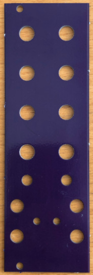
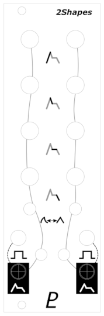
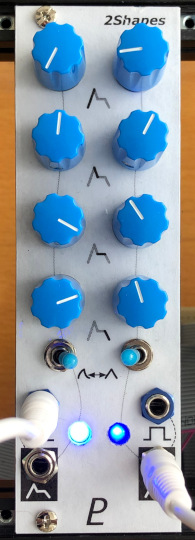

# Front Panels

Some of these modules were made with a [Delptronics Module Construction Set](https://delptronics.com/module-construction-set.php). This includes an alumin(i)um front panel with a drilling template printed on it.

Other modules use PCBs that I designed, so the front panel is a PCB with holes.

The graphics are designed in [Inkscape](https://inkscape.org/), laser printed on adhesive-backed paper, and covered with a clear adhesive lamination sheet.

© 2022 Len Popp This work is licensed under a <a rel="license" href="http://creativecommons.org/licenses/by/4.0/">Creative Commons Attribution 4.0 International License</a>.

