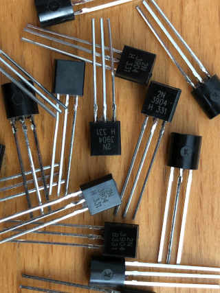

# Component Selection

Each of these module designs includes a bill of materials (BOM) that lists all of the components needed to build the module. I use the BOM to organize my component purchases, so most of the components have specific part numbers and distributor links.

But that doesn't mean that those exact parts must be used in every case. Many components, such as resistors, are available with similar specs from several manufacturers. Sometimes it matters which of those versions is used, sometimes it doesn't.

Here are some notes on how to select appropriate components to make these modules.

## Jellybeans

Run-of-the-mill jellybean components such as resistors can usually be substituted with any part with similar specs. Here are some rules of thumb for choosing these.

### Resistors

Most of the resistors I use are low-power metal film resistors with 1% precision. These are inexpensive, easily available, and stable. Most of the listed parts have a power rating of 1/6 W (166 mW) just because those are easy for me to get; anything down to 1/10 W (100 mW) should be fine.

Current-limiting resistors (for module outputs and LEDs) are specified for 1/4 W, just in case.

There are a few places where high-precision resistors are required. These are noted on the schematic.

### Capacitors

Electrolytic capacitors should have a voltage rating of at least 25 V DC, unless otherwised noted.

Decoupling caps for ICs are 100 nF ceramic, any make.

Capacitors in the audio signal path are mostly specified as film types, but good quality ceramic caps (C0G, NP0) can probably be used in many cases.

There are a few places where film capacitors with high stability and low leakage are required. These are noted on the schematic.

### Transistors

For bipolar transistors I use 2N3904 (NPN) and 2N3906 (PNP). Other general-purpose transistors can be used (e.g. BC548/558) but may require minor circuit adjustments. If in doubt, test the circuit on a breadboard.

## Op Amps

I use TL07x series op amps in my modules. These are widely used in synthesizers. Pretty much any op amp with a standard pinout that can operate on a +/- 12 V supply can probably be substituted.

## Front Panel Parts

Jacks, switches, and potentiometers on the front panel must be as specified, or substituted with parts that have the same footprint and physical dimensions. These parts are soldered directly to a PCB and also fixed to the front panel, so they have to fit properly. The components that I use are ones that are commonly used in the synth DIY community. I have tried to list multiple sources for these in the BOM.

The Alpha potentiometers are available with different shafts - 6.35 mm (1/4 inch) round, 6 mm knurled, or 6 mm D-shape. Use any of these, just make sure to get knobs that fit.

### Knobs

Potentiometers need knobs, but I have not listed any in my BOMs because they are a matter of taste. They also need to fit the potentiometers (see above).

© 2022 Len Popp This work is licensed under a <a rel="license" href="http://creativecommons.org/licenses/by/4.0/">Creative Commons Attribution 4.0 International License</a>.

