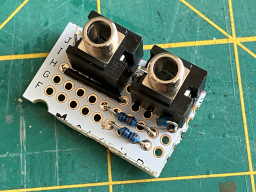
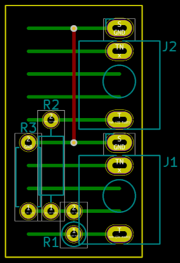

# Attenuator

_Eurorack attenuator dongle_

## Features
- Passive attenuator, approximately -20 dB
- A small dongle that can be patched between modules or devices
- Bidirectional - plug it in either way around!

## Notes
I made two of these small attenuator dongles for my Eurorack system because I kept running into situations where I want to knock down the signal level by a large amount. I have a fancy [attenuverter module](../../modules/Attenuverter/) but I just wanted something small and simple that would leave the attenuverter free for more important jobs.

My particular reasons for using this attenuator are:
* _Using a tuner (or other external device)_ - I have a [tuner](https://www.korg.com/caen/products/tuners/ot_120/) that has trouble with the signal level straight out of a Eurorack VCO, so I keep one of these attenuators plugged into the tuner.
* _Bad design choices_ - I made the pitch mod inputs on my oscillator modules way too sensitive. Even though there's an attenuator control on the input, it's hard to get a reasonable vibrato when I patch in an LFO. Sending the LFO through this attenuator gives a much better range of adjustment on the pitch mod input, for most purposes.

The device is assembled on a small piece of stripboard PCB. See the attached layout diagram.

Please note that I am a hobbyist, not a trained electronics engineer. No guarantees!

## Software Used

* [KiCad](https://www.kicad.org/) 7.0.8

 © 2024 Len Popp CC BY This work is licensed under a <a rel="license" href="http://creativecommons.org/licenses/by/4.0/">Creative Commons Attribution 4.0 International License</a>.

