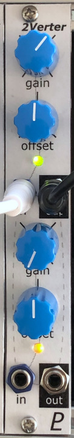

# Dual Attenuverter

## 4HP Eurorack Module

### Features
- Gain knob multiplies the input signal by 2 when turned to max and by -1 (i.e. inverted) when turned all the way down.
- Offset knob adds an offset voltage in the range of -5 V to +5 V.
- Channel 1's input is normalled from +5 V so it can be used as an adjustable CV source.
- Channel 2's input is normalled from channel 1's input.
- If channel 1's output is not patched, it is normalled to mix with channel 2's output. (Please note that this can cause unintended results if channel 2 is used without using channel 1.)

### Notes
For best results, the gain potentiometers (RV1 & RV3) should be very close to 100 kΩ. The pots specified for this project have a tolerance of 20% so I recommend measuring a few and selecting the most accurate ones.

PCB layouts are provided in KiCad and gerber formats. A PCB layout for a drilled front panel (with no labels) is also included.

The PCBs that I used can be ordered from OSH Park. The designs are here:
- [Front panel](https://oshpark.com/shared_projects/6utvepvX)
- [Controls board](https://oshpark.com/shared_projects/9pQK8wer)
- [Main board](https://oshpark.com/shared_projects/1qgK0ORb)

Please note that I am a hobbyist, not a trained electronics engineer. No guarantees!

### Software Used

* [KiCad](https://www.kicad.org/) 6.0.6

 © 2022 Len Popp CC BY This work is licensed under a <a rel="license" href="http://creativecommons.org/licenses/by/4.0/">Creative Commons Attribution 4.0 International License</a>.

