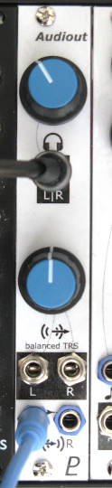

# Audiout - Stereo Output Module

## 4HP Eurorack Module

TODO: new photo

### Features
- _Input:_ Eurorack jacks for left & right channels, with left normalled to right for mono
- _Headphone output:_ 3.5 mm stereo headphone jack
- _Balanced stereo line output:_ 3.5 mm TRS jacks for left & right channels. Requires two cables with a 3.5 mm TRS plug on one end and either a 1/4 inch TRS or XLR plug on the other end.
- Separate level controls for headphone and line outputs.

### Notes
This module requires a 16-pin Eurorack power cable that supplies +5 V power in addition to +12 V and -12 V.

PCB layouts are provided in KiCad and gerber formats. A front panel design is included as a drilled PCB layout (with no labels or graphics).

The PCBs that I used can be ordered from OSH Park. The designs are here:
- [Front panel](https://oshpark.com/shared_projects/ir0qqB0Y)
- [Controls board](https://oshpark.com/shared_projects/OsCKzftx)
- [Main board](https://oshpark.com/shared_projects/VA7ex4FE)

Please note that I am a hobbyist, not a trained electronics engineer. No guarantees!

### Software Used
[KiCad](https://www.kicad.org/) 6.0.4

 © 2022 Len Popp CC BY This work is licensed under a <a rel="license" href="http://creativecommons.org/licenses/by/4.0/">Creative Commons Attribution 4.0 International License</a>.

