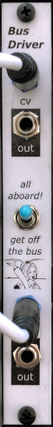

# Bus Driver

## 3HP Eurorack Module

This module sends CV and gate signals to the Eurorack bus, for any modules that pay attention to those bus lines.

### Features
- CV and gate inputs are sent to the corresponding lines on the Eurorack power bus
- Inputs are also copied to output jacks on the front panel
- Bus and front panel outputs are buffered separately
- Inputs are normalled to 0 V, and can be completely disconnected from the bus by a switch

### Notes
This module is only useful if you have other modules that can use the CV & gate signals on the Eurorack bus (such as my [VCO](https://github.com/Len42/Synth/tree/main/modules/VCO-2131) and [envelope](https://github.com/Len42/Synth/tree/main/modules/Envelope2) modules, for example).

The CV and gate inputs could come from a keyboard, or a sequencer, or an [interface module](https://www.expert-sleepers.co.uk/es8.html).

It's important to ensure that this module is the only one in the system that is sending signals to the Eurorack bus CV & gate lines! Several modules may _receive_ those signals, but only one can send them.

There is a switch to disconnect the CV & gate signals from the Eurorack bus.

This module requires a 16-pin Eurorack power cable, but it does not depend on +5V power from the Eurorack system. Note that this module has only a single-row power connector (due to the module being so slim). It can plug into either side of the standard 16-pin cable connector - just make sure to plug in the cable with the red stripe next to the -12 V indication on the module, as always.

PCB layouts are provided in KiCad and gerber formats. A PCB layout for a drilled front panel (with no labels) is also included.

The PCBs that I used can be ordered from OSH Park. The designs are here:
- [Front panel](https://oshpark.com/shared_projects/DCkcxofG)
- [Controls board](https://oshpark.com/shared_projects/zJFNumpm)
- [Main board](https://oshpark.com/shared_projects/tTGp0mmq)

Please note that I am a hobbyist, not a trained electronics engineer. No guarantees!

### Software Used

* [KiCad](https://www.kicad.org/) 6.0.5

 © 2022 Len Popp CC BY This work is licensed under a <a rel="license" href="http://creativecommons.org/licenses/by/4.0/">Creative Commons Attribution 4.0 International License</a>.

