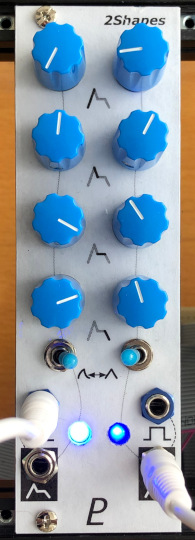

# Dual Envelope Generator

## 8HP Eurorack Module

### Features
- Two ADSR envelope generators
- Attack, decay, and release times range from very short (< 1 millisecond) to approx. 10 seconds
- Envelopes are switchable between linear and logarithmic curves
- Gate input can default to the Eurorack bus gate line (jumper-selectable)
- Channel 1 gate input is normalled to channel 2 so one gate signal can trigger both envelopes

### Notes
This module requries a 16-pin Eurorack power cable that supplies +5 V power in addition to +12 V and -12 V.

An Arduino-compatible ATmega328P microcontroller generates the envelopes. The firmware source code is in [firmware/Envelope2/Envelope2.ino](firmware/Envelope2/Envelope2.ino). MakeLookupTables is a program that generates data tables used in the firmware. See [here](https://len42.github.io/Synth/firmware-programming.html) for info about programming the firmware onto the microcontroller chip.

PCB layouts are provided in KiCad and gerber formats. A front panel design is included as a drilled PCB layout (with no labels or graphics).

The PCBs that I used can be ordered from OSH Park. The designs are here:
- [Front panel](https://oshpark.com/shared_projects/PnWXqRcs)
- [Controls board](https://oshpark.com/shared_projects/XBUi1v48)
- [Main board](https://oshpark.com/shared_projects/cbrPcghP) (Note: There is an error in this PCB which has been corrected in the current version of the KiCad & gerber files.)

Please note that I am a hobbyist, not a trained electronics engineer. No guarantees!

 © 2022 Len Popp CC BY This work is licensed under a <a rel="license" href="http://creativecommons.org/licenses/by/4.0/">Creative Commons Attribution 4.0 International License</a>.

