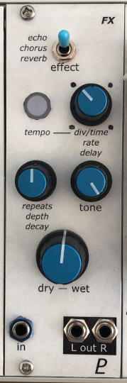
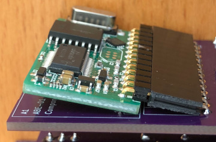

# Digital Effects Module

## 8HP Eurorack Module

### Features
- Chorus, echo, or plate reverb effect
- Stereo outputs
- Lighted pushbutton for tap tempo
- Uses an [Accu-Bell Effector](https://www.tubesandmore.com/sites/default/files/associated_files/p-r-abe.pdf) DSP module

### Notes
Chorus and reverb effects are stereo; echo is mono, output to both channels.

I wanted the DSP module to lie flat on the PCB so I used a right-angle socket header connector, but the connector's pins are too short so it ended up sitting at an angle:

The DSP module could be soldered directly to the PCB instead, so that it sticks out vertically.

PCB layouts are provided in KiCad and gerber formats. A PCB layout for a drilled front panel is also included.

The PCBs that I used can be ordered from OSH Park. The designs are here:
- [Front panel](https://oshpark.com/shared_projects/IcfnjVSe)
- [Controls board](https://oshpark.com/shared_projects/3NuuYXm0)
- [Main board](https://oshpark.com/shared_projects/yNs2Zlux)

Please note that I am a hobbyist, not a trained electronics engineer. No guarantees!

### Software Used

* [KiCad](https://www.kicad.org/) 6.0.8

 © 2022 Len Popp CC BY This work is licensed under a <a rel="license" href="http://creativecommons.org/licenses/by/4.0/">Creative Commons Attribution 4.0 International License</a>.

