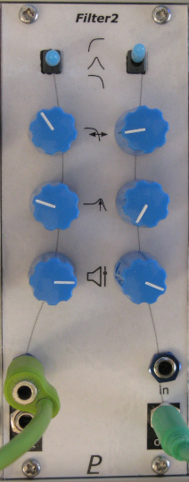

# Filter2 - Dual Filter Module

## 10HP Eurorack Module

_Variable formant or whatever filters_

### Features
- Two separate multi-mode filters (low/high/band-pass)
- _Not_ voltage controlled. Use your fingers!
- Frequency, resonance, and gain controls
- Channel 1 input is normalled to channel 2

### Notes
[TBD: notes]

PCB layouts are provided in KiCad and gerber formats. A PCB layout for a drilled front panel (with no labels) is also included.

(TBD) The PCBs that I used can be ordered from OSH Park. The designs are here:
- [Controls board](https://oshpark.com/shared_projects/zzz)
- [Middle board](https://oshpark.com/shared_projects/zzz)
- [Back board](https://oshpark.com/shared_projects/zzz)

Please note that I am a hobbyist, not a trained electronics engineer. No guarantees!

### Acknowledgements

[Quad Bandpass, Parametric Equalizer - haraldswerk](https://www.haraldswerk.de/Filter/Bandpass_quad/Bandpass_quad.html)

### Software Used

* [KiCad](https://www.kicad.org/) 7.0.8

 © 2023 Len Popp CC BY This work is licensed under a <a rel="license" href="http://creativecommons.org/licenses/by/4.0/">Creative Commons Attribution 4.0 International License</a>.

