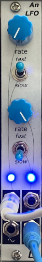

# Dual Analog LFO

## 4HP Eurorack Module

### Features
- Two independent analog LFOs
- LFO rate from approximately 0.01 Hz (100 seconds) to 170 Hz, in two ranges
- Each LFO has sine and square wave outputs
- Not voltage controlled. Use your fingers! 👌

### Notes
(I have also made a [voltage-controlled digital LFO](https://github.com/Len42/Synth/tree/main/modules/LFO-DigiVC#readme).)

PCB layouts are provided in KiCad and gerber formats. A PCB layout for a drilled front panel (with no labels) is also included.

The PCBs that I used can be ordered from OSH Park. The designs are here:
- [Front panel](https://oshpark.com/shared_projects/gXxsPQ2r)
- [Controls board](https://oshpark.com/shared_projects/Vs8kgjxu)
- [Main board](https://oshpark.com/shared_projects/36ruR2I4)

There is a [parts list](bom.csv) in spreadsheet-friendly text format.

Please note that I am a hobbyist, not a trained electronics engineer. No guarantees!

### Software Used

* [KiCad](https://www.kicad.org/) 8.0.2

 © 2024 Len Popp CC BY This work is licensed under a <a rel="license" href="http://creativecommons.org/licenses/by/4.0/">Creative Commons Attribution 4.0 International License</a>.

