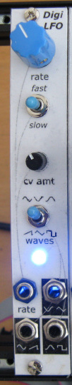

# Voltage-Controlled Digital LFO

## 4HP Eurorack Module

### Features
- LFO rate from approximately 0.06 Hz (17 seconds) to 220 Hz (A3)
- CV input for LFO rate, with attenuator
- Three simultaneous waveform outputs, switchable between:
    - triangle, ramp, and square; or
	- three sine waves, 120° out of phase

### Notes
With the CV attenuator turned all the way up, the CV input tracks 1 volt/octave. The LFO can play notes up to A3 (below middle C) but it's fiddly to tune.

The LFO is implemented with an Arduino-compatible ATmega328P microcontroller. The firmware source code is an Arduino sketch in [firmware/DigiLFO/DigiLFO.ino](firmware/DigiLFO/DigiLFO.ino). MakeLookupTables is a program that generates data tables used in the firmware. See [here](https://lenp.net/synth/firmware-programming.html) for info about programming the firmware onto the microcontroller chip.

This module is built using the [Delptronics Module Construction Set](https://delptronics.com/module-construction-set.php) which includes PCBs for the front panel controls and other components. The PCB layout file is just a guide showing how I placed the components on the Delptronics boards. (It's a bit of a mess - sorry!)

Please note that I am a hobbyist, not a trained electronics engineer. No guarantees!

### Software Used
* [KiCad](https://www.kicad.org/) 5.1.10-1
* [Arduino](https://www.arduino.cc/) 1.8.18
* (optional) [Visual Studio 2019](https://visualstudio.microsoft.com/) - Only used to generate the numtables.h file, which is provided.

© 2022 Len Popp This work is licensed under a <a rel="license" href="http://creativecommons.org/licenses/by/4.0/">Creative Commons Attribution 4.0 International License</a>.

