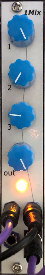

# Mixer1

## 4HP Eurorack Module

_Half of a [Mixer2](../Mixer2)_

### Features
- 3 -> 1 mixer
- Can be used with CV or audio signals - the inputs are DC coupled
- Input attenuators and output level control
- LED shows the audio signal level

### Notes
I have used linear potentiometers for the level controls. Audio-taper pots would be better for mixing audio signals, but this mixer is meant to work with both audio and CV signals and I find linear pots to be a better compromise.

An LED indicates when the output exceeds the nominal maximum level for Eurorack audio signals, which is 10 V peak-to-peak (-5 V to +5 V). Audio signals with a greater amplitude than that may cause clipping in some modules.
The bi-colour LED is off when the output level is very low or there is no input connected; green when there is a signal up to about 8 V p-p; yellow(ish) to orange(ish) as the output approaches 10 V p-p; and red above about 10 V p-p. Note that these voltage levels are approximate and the LED gives only a rough indication of whether the audio signal level is in the appropriate range.
For CV signals, the LED is less useful - it lights up only when the mixed output is a positive voltage.

PCB layouts are provided in KiCad and gerber formats. A drilling template is provided for the front panel.

(TODO) The PCBs that I used can be ordered from OSH Park. The designs are here:
- [Main board](https://oshpark.com/shared_projects/zzz)
- [Controls board](https://oshpark.com/shared_projects/zzz)

Please note that I am a hobbyist, not a trained electronics engineer. No guarantees!

### Software Used

* [KiCad](https://www.kicad.org/) 6.0.8

 © 2022 Len Popp CC BY This work is licensed under a <a rel="license" href="http://creativecommons.org/licenses/by/4.0/">Creative Commons Attribution 4.0 International License</a>.

