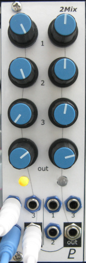

# Dual 3:1 Mixer

## 8HP Eurorack Module

### Features
- Two-channel mixer with 3 inputs per channel
- Can be used with CV or audio signals (the inputs are DC coupled)
- Input faders and output level controls
- Channel 1 output is normalled to mix with channel 2 when unplugged, to mix 6 inputs to one output
- Level indicator LED for each channel shows when the output level exceeds +/- 5 V (nominal max level for audio signals)

### Notes
[notes]

PCB layouts are provided in KiCad and gerber formats. A drilling template is provided for the front panel.

(TBD) The PCBs that I used can be ordered from OSH Park. The designs are here:
- [Controls board](https://oshpark.com/shared_projects/zzz)
- [Middle board](https://oshpark.com/shared_projects/zzz)
- [Back board](https://oshpark.com/shared_projects/zzz)

Please note that I am a hobbyist, not a trained electronics engineer. No guarantees!

### Software Used

* [KiCad](https://www.kicad.org/) 6.0.6

 © 2022 Len Popp CC BY This work is licensed under a <a rel="license" href="http://creativecommons.org/licenses/by/4.0/">Creative Commons Attribution 4.0 International License</a>.

