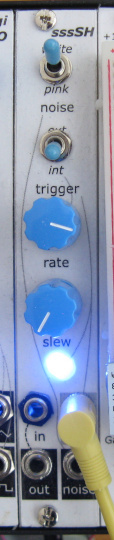

# Noise / Sample & Hold

## 4HP Eurorack Module

### Features
- White and pink(ish) noise output
- Sample-and-hold with variable slew rate
- S&H can be triggered by an internal clock or external input
- Internal clock is output on the trigger jack when selected

### Notes

This module is built using the [Delptronics Module Construction Set](https://delptronics.com/module-construction-set.php) which includes PCBs for the front panel controls and other components. The PCB layout file is just a guide showing how I placed the components on the Delptronics boards. (It's a bit of a mess - sorry!)

Please note that I am a hobbyist, not a trained electronics engineer. No guarantees!

### Acknowledgements

[synthnerd](https://synthnerd.wordpress.com/2020/03/09/synth-diy-a-white-noise-generator/)

[Mutable Instruments](https://mutable-instruments.net/modules/kinks/open_source/)

### Software Used

[KiCad](https://www.kicad.org/) 5.1.10-1

© 2022 Len Popp This work is licensed under a <a rel="license" href="http://creativecommons.org/licenses/by-sa/4.0/">Creative Commons Attribution-ShareAlike 4.0 International License</a>.

