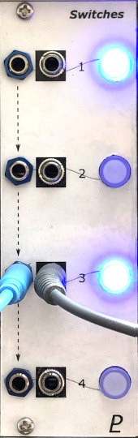

# Switches

## 8HP Eurorack Module

_4-channel muting module_

### Features
- 4 channels with individual mute switches
- Soft-touch pushbuttons that light up when the channel is "on"
- JFET "soft switching" for click-free muting
- Each input is normalled to the next one

### Notes
Due to the JFET cut-off voltage, signals below approx. -8 V are not passed through. This does not affect "normal" audio or CV signals, but an over-driven audio signal may be clipped or an extremely negative CV may be altered.

This module requires a 16-pin Eurorack power cable that supplies +5 V power in addition to +12 V and -12 V.

PCB layouts are provided in KiCad and gerber formats. A PCB layout for a drilled front panel (with no labels) is also included.

(TBD) The PCBs that I used can be ordered from OSH Park. The designs are here:
- [Main board](https://oshpark.com/shared_projects/zzz)
- [Controls board](https://oshpark.com/shared_projects/zzz)
- [Front panel](https://oshpark.com/shared_projects/zzz)

Please note that I am a hobbyist, not a trained electronics engineer. No guarantees!

### Software Used

* [KiCad](https://www.kicad.org/) 7.0.8

 © 2023 Len Popp CC BY This work is licensed under a <a rel="license" href="http://creativecommons.org/licenses/by/4.0/">Creative Commons Attribution 4.0 International License</a>.

