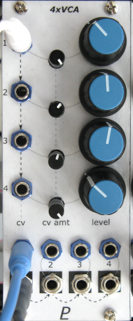

# Quad VCA

## 10HP Eurorack Module

### Features
- Four exponential VCAs based on an [SSI2164 chip](https://www.soundsemiconductor.com/downloads/ssi2164datasheet.pdf)
- Each CV input is normalled to the next one, so one CV can control multiple channels
- Each output is normalled to mix with the next channel's input

### Notes
PCB layouts are provided in KiCad and gerber formats. A front panel design is included as a drilled PCB layout (with no labels or graphics).

(TBD) The PCBs that I used can be ordered from OSH Park. The designs are here:
- [Front panel](https://oshpark.com/shared_projects/zzz)
- [Controls board](https://oshpark.com/shared_projects/zzz)
- [Middle board](https://oshpark.com/shared_projects/zzz)
- [Back board](https://oshpark.com/shared_projects/zzz)

Please note that I am a hobbyist, not a trained electronics engineer. No guarantees!

 © 2022 Len Popp CC BY This work is licensed under a <a rel="license" href="http://creativecommons.org/licenses/by/4.0/">Creative Commons Attribution 4.0 International License</a>.

