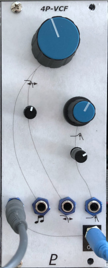

# Four-Pole VCF

## 10HP Eurorack Module

_A low-pass filter using the SSI2140 chip_

### Features
- Four-pole, 24 db/octave low-pass filter made with an [SSI2140 IC](https://soundsemiconductor.com/downloads/ssi2140datasheet.pdf)
- Self-oscillates at maximum resonance
- Two CV inputs for cutoff frequency. One is 1V/octave and the other has an input attenuator.
- 1V/octave input can default to the Eurorack bus CV line (jumper-selectable)
- Resonance CV input with attenuator
- A large knob

### Notes
The cutoff CV inputs can be trimmed to track 1V/octave pretty well (but not as accurately as a VCO). Due to variations between different SSI2140 chips, it may be necessary to change the value of R31 to get proper scaling. If you don't care about precise volt/octave scaling, just set the trim pots RV9 & RV10 somewhere near the middle, or even replace them with fixed 4.7 kΩ resistors.

The SSI2140 VCF chip comes in an SSOP package that I cannot solder, but fortunately it's also available pre-soldered to a breakout board - that's what I use here.

The filter capacitors C8-C11 are specified as high-stability types. Traditionally, polystyrene caps would be used, but those are hard to come by these days (hardly anyone makes them any more) so I've chosen PPS film caps. Ordinary polyester film caps might be OK, or audio-grade ceramics (C0G/NP0 type).

This module requires a 16-pin Eurorack power cable, but it does not depend on +5V power from the Eurorack system.

PCB layouts are provided in KiCad and gerber formats. A front panel design is included as a drilled PCB layout (with no labels or graphics).

The PCBs that I used can be ordered from OSH Park. The designs are here:
- [Front panel](https://oshpark.com/shared_projects/uQCignas)
- [Controls board](https://oshpark.com/shared_projects/4RLSW85r)
- [Main board](https://oshpark.com/shared_projects/U6pC6p9E)

Please note that I am a hobbyist, not a trained electronics engineer. No guarantees!

### Software Used

* [KiCad](https://www.kicad.org/) 6.0.6

 © 2022 Len Popp CC BY This work is licensed under a <a rel="license" href="http://creativecommons.org/licenses/by/4.0/">Creative Commons Attribution 4.0 International License</a>.

