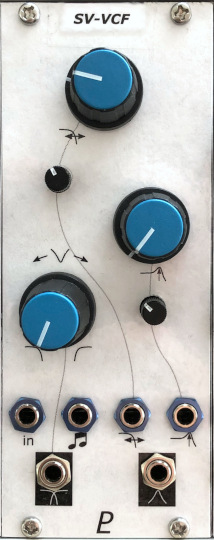
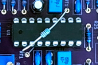

# State-Variable VCF

## 10HP Eurorack Module

_A state-variable filter using the CEM3320 chip_

### Features
- Two-pole state-variable filter made with a [CEM3320 IC](https://electricdruid.net/wp-content/uploads/2017/06/CEM3320-VCF.pdf)
- Two separate outputs:
    - Continuously-variable low-pass - notch - high-pass filter response
    - Bandpass filter
- Self-oscillates at maximum resonance
- Two CV inputs for cutoff/centre frequency. One is 1V/octave and the other has an input attenuator.
- 1V/octave input can default to the Eurorack bus CV line (jumper-selectable) - more info [here](https://lenp.net/synth/eurorack-bus-cv-gate.html)
- Resonance CV input with attenuator

### Notes
The cutoff CV inputs can be trimmed to track 1V/octave pretty well (but not as accurately as a VCO). The temperature-compensation resistor, RT1, should be mounted in thermal contact with the CEM3320 chip (see photo).

This module requires a 16-pin Eurorack power cable, but it does not depend on +5V power from the Eurorack system.

### Calibration
There are three trimmer potentiometers on the back of the module that should be adjusted for best results.

First, adjust the "DC TRIM" trimmer (RV8) to minimize control voltage feedthrough.
- Disconnect all inputs from the module.
- Set the cutoff and resonance controls fully counter-clockwise.
- Connect an audio signal (e.g. from a VCO) to the module's volt-per-octave CV input.
- Connect either of the the module's outputsj to an oscilloscope, or just listen to it.
- Adjust RV8 for the minimum output signal.

Then adjust RV6 (TUNE) and RV7 (SCALE) so the cutoff/centre frequency responds accurately to the volt-per-octave CV input. If you care.
- Disconnect the module's audio input.
- Connect a keyboard or other pitch CV source to the module's the 1V/octave CV input.
- Turn the resonance control fully clockwise. This will cause the filter to oscillate.
- Connect either of the the module's outputs to a tuner or frequency counter.
- Adjust RV6 & RV7 while playing different notes until the output is in tune (more or less) across several octaves.

Don't expect the tuning to be as accurate or as stable as a VCO.

If you don't care about precise volt/octave scaling, you can just set the trim pots RV6 & RV7 somewhere near the middle, or even replace them with fixed resistors (13 kΩ and 4.7 kΩ respectively). Also, you may replace tempco resistor RT1 with an ordinary resistor (1% metal film preferred).

### PCBs
PCB layouts are provided in KiCad and gerber formats. A PCB layout for a drilled front panel (with no labels) is also included.

The PCBs that I used can be ordered from OSH Park. The designs are here:
- [Front panel](https://oshpark.com/shared_projects/KgoN3yfz)
- [Controls board](https://oshpark.com/shared_projects/U095EDGt)
- [Main board](https://oshpark.com/shared_projects/O1sdHBEZ)

Please note that I am a hobbyist, not a trained electronics engineer. No guarantees!

### Acknowledgements

This design is based in part on the [Tellun TLN-428 module by Scott Juskiw](http://www.tellun.com/motm/diy/tln428/TLN-428.html).

### Software Used

* [KiCad](https://www.kicad.org/) 6.0.9

 © 2022 Len Popp CC BY This work is licensed under a <a rel="license" href="http://creativecommons.org/licenses/by/4.0/">Creative Commons Attribution 4.0 International License</a>.

