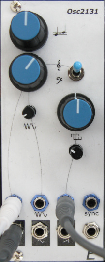

# Analog VCO

## 10HP Eurorack Module

### Features
- Analog VCO with sawtooth, triangle, and square/pulse outputs
- Pitch, PWM, and sync CV inputs
- Coarse/fine tuning knobs and +/- 2-octave switch
- Based on an [SSI2131 VCO chip](https://soundsemiconductor.com/downloads/ssi2131datasheet.pdf)
- Volt-per-octave tracking over 10 octaves
- 1V/octave input can default to the Eurorack bus CV line (jumper-selectable)

### Notes
This module requires a 16-pin Eurorack power cable, but it does not depend on +5V power from the Eurorack system.

[Here are instructions for calibration](calibration.md) of the VCO for proper 1V/octave tracking.

The sub-oscillator circuit on the schematic **does not work!** Sorry about that. That circuit and the associated output jack can be omitted.

PCB layouts are provided in KiCad and gerber formats.
A drilling template is provided for the front panel.

The PCBs that I used can be ordered from OSH Park. The designs are here:
- [Controls board](https://oshpark.com/shared_projects/8MjA3NoD)
- [Middle board](https://oshpark.com/shared_projects/c16FyR7y)
- [Back board](https://oshpark.com/shared_projects/S84ptGBY)

Please note that I am a hobbyist, not a trained electronics engineer. No guarantees!

### Software Used

[KiCad](https://www.kicad.org/) 6.0.2

 © 2022 Len Popp CC BY This work is licensed under a <a rel="license" href="http://creativecommons.org/licenses/by/4.0/">Creative Commons Attribution 4.0 International License</a>.

