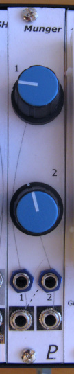

# Simple Wavefolder V2

## 4HP Eurorack Module

### Features
- Two separate wavefolding channels
- Channel 1 output is normalled to channel 2 input to give double the folding
- Front panel knobs control the degree of folding for each channel

### Notes
This is version 2 of the Wavefolder module. [Version 1](../Wavefolder-v1/) used the same circuit but was built using the [Delptronics Module Construction Set](https://delptronics.com/module-construction-set.php) instead of a custom PCB.

The amount of folding is controlled by the level of the input signal which is adjusted by an attenuator pot on the input. There are no CV inputs, but CV control of the folding can be done by running the input signal through a VCA.

The circuit design is based on [Ken Stone's Simple Wave Folder](https://www.elby-designs.com/webtek/cgs/cgs52/cgs52_folder.html) and [yusynth's Metalizer](http://yusynth.net/Modular/EN/METALIZER/).

PCB layouts are provided in KiCad and gerber formats. A PCB layout for a drilled front panel (with no labels) is also included.

The PCBs that I used can be ordered from OSH Park. The designs are here:
- [Front panel](https://oshpark.com/shared_projects/uywe7ayj)
- [Controls board](https://oshpark.com/shared_projects/bExOOKeW)
- [Main board](https://oshpark.com/shared_projects/pl6nXBNP)

Please note that I am a hobbyist, not a trained electronics engineer. No guarantees!

### Software Used

* [KiCad](https://www.kicad.org/) 7.0.8

 © 2024 Len Popp CC BY This work is licensed under a <a rel="license" href="http://creativecommons.org/licenses/by/4.0/">Creative Commons Attribution 4.0 International License</a>.

